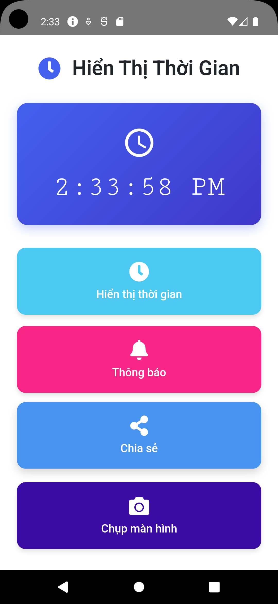

Đây là ứng dụng sử dụng Capacitor để hiển thị thời gian hiện tại của người dùng (giờ địa phương).
Ứng dụng có thể:
-Hiển thị thời gian hiện tại của người dùng
-Thông báo cục bộ hiển thị thời gian hiện tại.
-Chia sẻ thời gian hiện tại.
-Chụp ảnh màn hình ứng dụng
